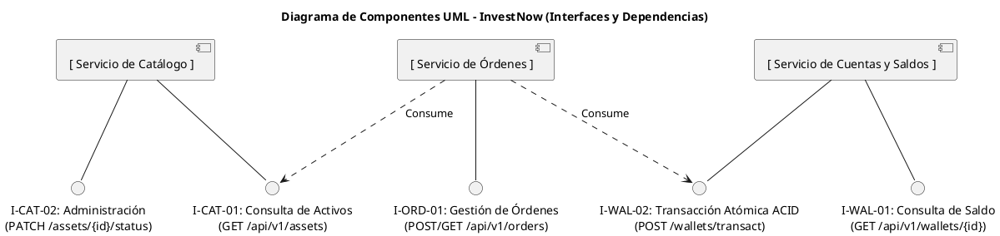

# Documento de Alcance y Definición Arquitectónica: Demostración Unidad 3 (*InvestNow*)

> Documento de entrega de la **Unidad Temática 3**, incremental sobre
> [`../UT2/ENTREGA.md`](../UT2/ENTREGA.md) (y sobre el contexto de
> negocio y requerimientos de [`../UT1/ENTREGA.md`](../UT1/ENTREGA.md)).
> Para los comandos `curl` de
> verificación de cada interfaz ver
> [`PRUEBAS_ENDPOINTS.md`](PRUEBAS_ENDPOINTS.md); para la visión general
> del proyecto y cómo levantar el stack completo, ver el
> [`README.md`](../../README.md) de la raíz.

## 1. Introducción y Ajuste de Alcance para la Demo

El alcance del dominio fintech *InvestNow* consta de una API REST funcional que interconecta tres microservicios esenciales. Se descartan temporalmente las integraciones externas complejas en tiempo real (como pasarelas bancarias o brokers reales) simulándolas mediante contratos internos o mocks estables, garantizando que el sistema sea completamente testeable mediante `curl` o Postman y desplegable mediante contenedores.

---

## 2. Definición de Componentes, Interfaces y Dependencias

La solución se descompone en tres componentes principales desacoplados:

1. **Servicio de Catálogo y Activos**
* **Responsabilidad:** Administra el listado de activos financieros disponibles para operar (acciones, ETFs, criptomonedas) y su estado de habilitación.
* **Interfaces Expuestas:**
* `GET /api/v1/assets` (Pública, REST/JSON): Permite consultar el catálogo de activos.
* `PATCH /api/v1/assets/{id}/status` (Administración, REST/JSON): Modifica el estado de habilitación de un activo.


* **Interfaces Consumidas:** Ninguna.
* **Dependencias:** Ninguna (actúa como proveedor de datos primarios de catálogo).


2. **Servicio de Cuentas y Saldos (Wallet)**
* **Responsabilidad:** Administra el balance de los usuarios y aplica operaciones financieras atómicas.
* **Interfaces Expuestas:**
* `GET /api/v1/wallets/{user_id}` (Pública, REST/JSON): Consulta el saldo y portafolio del usuario.
* `POST /api/v1/wallets/transact` (Interna, REST): Interfaz de servicio a servicio para debitar o acreditar fondos de manera estricta.


* **Interfaces Consumidas:** Ninguna.
* **Dependencias:** Base de datos relacional transaccional (motor ACID).


3. **Servicio de Órdenes (Core de Negocio)**
* **Responsabilidad:** Procesa las solicitudes de compra y venta de activos por parte de los usuarios, aplicando validaciones de negocio.
* **Interfaces Expuestas:**
* `POST /api/v1/orders` (Pública, REST/JSON): Recibe la intención de compra o venta de un activo.
* `GET /api/v1/orders/{user_id}` (Pública, REST/JSON): Consulta el historial de órdenes del usuario.


* **Interfaces Consumidas:**
* Consume la interfaz de consulta del *Servicio de Catálogo* para verificar si el activo está habilitado antes de procesar la orden.
* Consume la interfaz interna del *Servicio de Cuentas y Saldos* para bloquear o debitar el dinero de forma sincronizada.


* **Dependencias:** *Servicio de Catálogo* y *Servicio de Cuentas y Saldos*.

### Diagrama de componentes (fuente PlantUML)

Pegar el bloque de abajo en https://editor.plantuml.com para visualizarlo.



---

## 3. Justificación de la Partición de Primer Nivel

* **Criterio de partición:** Partición basada en **Dominios de Negocio (*Bounded Contexts*)**.
* **Justificación:** Se separa el dominio de **Catálogo** (foco en lectura y disponibilidad) del dominio **Transaccional/Órdenes y Saldos** (foco en consistencia estricta de datos financieros). Esta partición de primer nivel permite escalar de forma independiente las consultas de activos sin comprometer los límites de consistencia y seguridad requeridos para las operaciones monetarias de los usuarios.

---

## 4. Proceso para el Descubrimiento de Componentes

El proceso metodológico aplicado para llegar a esta estructura de componentes consistió en:

1. **Derivación de Casos de Uso:** Análisis de las interacciones principales del inversor (consultar activos, ver saldo, enviar órdenes de compra/venta).
2. **Análisis de Cohesión y Acoplamiento Funcional:** Agrupación de datos y comportamientos afines. Se detectó que la gestión de activos respondía a ciclos de vida administrativos distintos a la gestión de saldos monetarios o a la ejecución de intenciones de mercado, separándolos lógicamente.
3. **Mapeo de Contratos de Interfaz:** Definición estricta de los puntos de contacto (REST para clientes y para la comunicación sincrónica entre el servicio de órdenes y los servicios de catálogo/saldos), asegurando un acoplamiento débil y contratos bien tipados.

---

## 5. Análisis de Impacto de Infraestructura: Contenedores vs. Máquinas Virtuales

* **Opción elegida para la solución:** Contenedores (orquestados mediante `docker-compose`).
* **Análisis de impacto de la opción no elegida (Máquinas Virtuales):**
* *Despliegue y Empaquetado:* En lugar de empaquetar cada microservicio en una imagen ligera de Docker con su runtime aislado, se requeriría aprovisionar una máquina virtual completa por cada componente (o un monolito virtualizado). Esto elevaría la complejidad de configuración del sistema operativo invitado en cada nodo.
* *Consumo de Recursos y Densidad:* Las VMs duplicarían la sobrecarga de memoria RAM y CPU al arrancar un kernel de sistema operativo por separado para cada servicio, reduciendo la densidad de despliegue en entornos de desarrollo o pruebas.
* *Velocidad de Provisionamiento:* Los tiempos de inicio y pruebas dinámicas pasarían de segundos (contenedores) a minutos (aprovisionamiento de VMs), dificultando la agilidad en los scripts de demostración automatizada.


---

## 6. Análisis de Impacto de Modelos de Consistencia: ACID vs. BASE

* **Opción elegida para la solución:** Modelo **ACID con transacciones** (aplicado en el subsistema de saldos y órdenes).
* **Análisis de impacto de la opción no elegida (BASE - Consistencia Eventual):**
* *Pérdida de Atomicidad Financiera:* Si se adoptara un modelo BASE (priorizando disponibilidad y particionamiento mediante consistencia eventual), un usuario podría emitir una orden de compra y ver su saldo actualizado de manera diferida.
* *Riesgo de Negocio:* Esto permitiría condiciones de carrera (*race conditions*) donde un inversor podría gastar fondos inexistentes o duplicados antes de que la red propague el estado real del saldo a los demás microservicios.
* *Conclusión:* Para un dominio financiero, el sacrificio de consistencia que impone BASE resulta inaceptable, obligando a asumir el costo de bloqueo y sincronización estricta que provee ACID.

---

## 7. Implementación (Parte 2)

### ACID — transacción real con lock de fila

`wallet_service` persiste los saldos en la tabla `wallets` de Postgres
(esquema en `docker/postgres/init.sql`), no en memoria. `POST
/api/v1/wallets/transact` (`app/routers/wallet_router.py`) ejecuta, dentro
de una única transacción:

1. `SELECT balance FROM wallets WHERE user_id = %s FOR UPDATE` — toma un
   lock exclusivo de esa fila, bloqueando a cualquier otra transacción
   concurrente sobre el mismo usuario hasta que esta termine.
2. Valida que el nuevo saldo no sea negativo.
3. `UPDATE` del saldo.

Si algo falla (usuario inexistente, fondos insuficientes, o cualquier
excepción), la transacción hace rollback completo: nunca queda un saldo a
mitad de camino. `scripts/demo_ut3_acid.sh` dispara varios débitos
concurrentes sobre la misma cuenta y muestra que el resultado es
consistente.

### Servicios sin estado

`wallet_service` no guarda estado de negocio en el proceso: todo vive en
Postgres, compartido por cualquier instancia del servicio. Como
consecuencia, un contenedor de `wallet_service` puede reiniciarse (o
reemplazarse por uno nuevo) sin perder ni resetear el saldo de nadie —
`scripts/demo_ut3_stateless.sh` lo evidencia matando y recreando el
contenedor a mitad de una secuencia de operaciones.

`catalog_service`, en cambio, mantiene su catálogo en un diccionario en
memoria (`app/routers/catalog_router.py`) — una simplificación de alcance
deliberada (la letra permite ajustar el alcance funcional): a los fines de
esta demo solo la lectura (`GET /assets`) se trata como *stateless* y
apta para escalar horizontalmente; la administración (`PATCH
/assets/{id}/status`) solo afecta a la réplica que atendió esa request
puntual y no se sincroniza entre réplicas.

### Escalabilidad horizontal

`scripts/demo_ut3_scaling.sh` levanta 3 réplicas **adicionales** de
`catalog_service`, sin puerto fijo de host, como un proyecto de Compose
separado (`docker-compose.scaling.yml`) sobre la misma red
`investnow-net` que ya usa el stack principal. La instancia original
(la que publica el puerto 8002) sigue corriendo sin tocarse.

Todas las réplicas (la original + las 3 nuevas) quedan con el mismo alias
DNS `catalog_service` dentro de `investnow-net`, así que Docker reparte
las requests entre todas por *round-robin* automático — sin agregar
ningún balanceador nuevo a la arquitectura — y cada respuesta incluye
`served_by` (el hostname del contenedor que la atendió) para poder
comprobarlo.

**Aclaración deliberada:** el DNS round-robin de Docker demuestra el
*concepto* de escalabilidad horizontal (varias réplicas idénticas
atendiendo la misma responsabilidad, sin estado compartido entre ellas),
pero no reemplaza a un load balancer real. Le faltan capacidades que sí
tiene un LB de producción (nginx, HAProxy, un ALB):

- **Health checking:** Docker retira una entrada del DNS cuando el
  contenedor muere, pero no verifica que el proceso adentro responda
  correctamente (podría estar colgado o devolviendo errores).
- **Balanceo por request, no por conexión:** la resolución DNS ocurre una
  vez por conexión TCP; un cliente con *keep-alive* o *connection
  pooling* seguiría mandando todas sus requests a la misma réplica hasta
  reabrir conexión. Por eso el script abre una conexión nueva en cada
  llamada, para forzar una resolución distinta cada vez.
- **Solo round-robin simple:** sin *least-connections*, *weighted
  routing*, *sticky sessions* ni conciencia de la carga real de cada
  instancia.
- **Es L4/nombre, no L7:** no hay ruteo por path o header, TLS
  termination, retries ni *circuit breaking*.

Elegimos esta vía a propósito para demostrar el concepto sin sumar un
componente nuevo a la arquitectura, no porque desconozcamos la
diferencia con un load balancer real.

### Scripts de esta entrega

Requieren el stack levantado (`docker compose up --build`, con un `.env`
creado a partir de `.env.example`) corriendo en otra terminal.

| Script                          | Qué hace |
|----------------------------------|----------|
| `scripts/demo_ut3_acid.sh`       | Dispara 5 débitos concurrentes (`&` + `wait`) sobre el mismo usuario en `wallet_service` y muestra el saldo antes/después. El lock de fila (`FOR UPDATE`) los serializa: el resultado final es siempre consistente, nunca queda negativo ni se "pierde" un débito por una condición de carrera. Al terminar, restaura el saldo original del usuario para poder volver a correrlo. |
| `scripts/demo_ut3_stateless.sh`  | Debita saldo, mata y recrea el contenedor de `wallet_service` (`docker compose kill` + `up -d`), y vuelve a consultar el saldo. Como el estado vive en Postgres y no en el proceso, el débito se mantiene aunque el proceso haya muerto y arrancado de cero. Al terminar, restaura el saldo original. |
| `scripts/demo_ut3_scaling.sh`    | Levanta 3 réplicas adicionales de `catalog_service`, sin puerto fijo de host, como proyecto de Compose separado (`docker-compose.scaling.yml`) sobre la misma red que el stack principal; la instancia original (puerto 8002) no se toca. Dispara 8 requests desde dentro del contenedor de `order_service` (que ya tiene `httpx`) contra el nombre DNS interno `catalog_service`. Se ven distintos valores de `served_by` (hostname del contenedor) entre las respuestas, evidenciando el *round-robin* automático de Docker entre las 4 instancias — sin agregar ningún balanceador nuevo. Al terminar, baja solo las 3 réplicas adicionales. |

```bash
bash scripts/demo_ut3_acid.sh
bash scripts/demo_ut3_stateless.sh
bash scripts/demo_ut3_scaling.sh
```

`demo_ut3_scaling.sh` usa `docker compose exec`, así que hay que correrlo
desde el mismo directorio/contexto que el `docker compose up` (mismo
`.env` y mismo proyecto de compose).

Antes de correrlos, alcanza con las instrucciones de
[`PRUEBAS_ENDPOINTS.md`](PRUEBAS_ENDPOINTS.md) para validar que cada
servicio responde.
